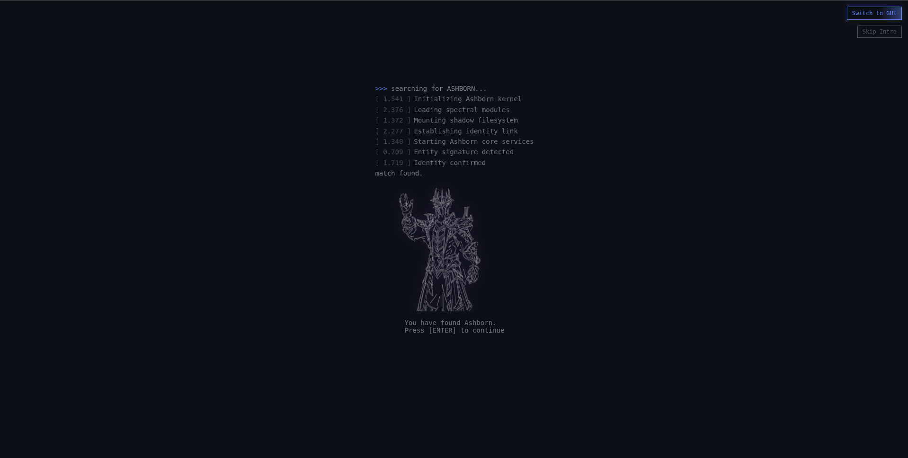

# UExASHBORN — CLI-Based Interactive Portfolio System

A command-driven, event-based interactive portfolio built using vanilla JavaScript.

This project simulates a terminal environment where users navigate content, execute commands, and interact with dynamic modules such as security simulations and a terminal-rendered rage game.

---

> Simulating a terminal-native experience inside the browser.
---

## Core Features

- Command-line interface (CLI) navigation
- Custom command parser and tokenizer
- Event-driven architecture (state + dispatch system)
- Modular rendering system (CLI + GUI support)
- Dynamic content loading using markdown

---

## Architecture

The system is built with a modular and extensible architecture:

- /src/core → state machine, parser, dispatcher, event bus
- /src/renderers → CLI + GUI rendering logic
- /src/games → interactive game engine modules
- /src/simulations → security-focused simulations
- /src/content → markdown-driven sections

---

## Modules

### Security Simulations
- Log anomaly detection
- SSH brute-force detection (Fail2Ban-based concept)

### Rage Game (Terminal Engine)
- Real-time terminal-rendered game loop
- Physics system (gravity, jump, collision)
- Multiple trap types (spikes, falling traps, fragile tiles)
- Multi-level progression system
- Keyboard-controlled movement
- Log anomaly detection
- SSH brute-force detection (Fail2Ban-based concept)

---

### Birdy (Procedural CLI Game System)

A lightweight terminal-based game focused on procedural generation and controlled difficulty scaling.

- Dynamic obstacle system (blocks + pipes)
- Procedural gap generation with guaranteed escape paths
- Targeted traps reacting to player position
- Difficulty scaling based on score progression
- Stable render pipeline (no layout shift / newline control)
- Freeze-state handling with restart system

**Engineering Focus:**
- Preventing impossible states (unavoidable collisions)
- Maintaining fixed terminal layout under dynamic rendering
- Balancing randomness vs fairness in obstacle generation 
- Managing game state transitions (live → freeze → restart)

---

## Example Commands
- open games
- play rage
- open soc
- back

---

## Run Locally

npm install
npm run dev

Then use the CLI inside the browser.

---

## Project Status

This project is under active development.

Planned improvements:
- More simulations
- Expanded game mechanics
- Performance optimizations 
- UI/UX refinements
- More simulations
- Expanded game mechanics
- Performance optimizations
- UI/UX refinements

---

## Motivation

This project was built to explore:

- Event-driven system design
- CLI-based interfaces in the browser
- Modular architecture for interactive systems
- Combining security concepts with interactive visualization
- Event-driven system design
- CLI-based interfaces in the browser
- Modular architecture for interactive systems
- Combining security concepts with interactive visualization

---

## Author

ADEEL ARIF
